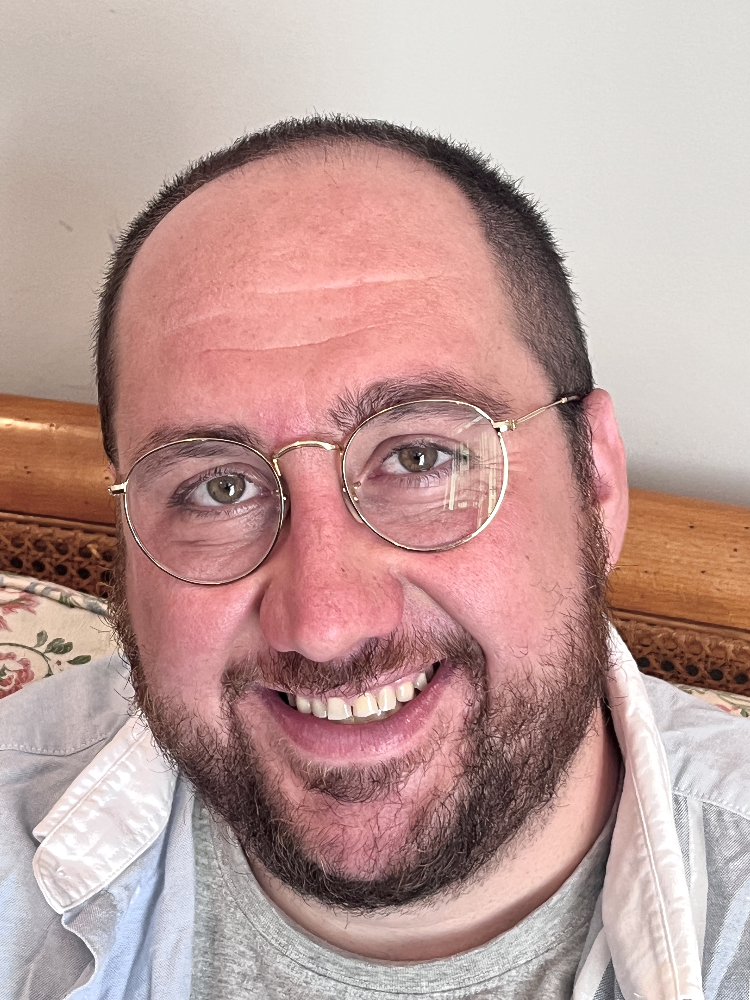

# About

Welcome! This site covers my work as a bioengineer.

I'm a postdoc in Lars Steinmetz's Lab at [Stanford Genetics](https://web.stanford.edu/group/steinmetzlab/cgi-bin/wordpress/). I build experimental techniques and computational models to map the broad effects of mutations in cells, with the goal of harnessing these maps for synthetic biology. I also engineer cells to have mitochondria with synthetic genomes, working some fantastic colleagues at [Powerhouse Bio](https://www.powerhouse.bio/). I did my Ph.D work in Bioengineering with [Tanja Kortemme](http://kortemmelab.ucsf.edu/) at [UCSF](https://graduate.ucsf.edu/bioe), using mutations to learn how allostery is essential for one protein to be multifunctional, regulating several distinct cellular pathways simultaneously.

Although proteins act at the molecular scale, they're part of a vast network in the cell. Small structural changes in proteins can undermine the health of cells, tissues, and entire organisms. Since this research question spans multiple biological scales, tackling it must be interdisciplinary: biochemistry and structural biology to study the molecular scale, systems techniques to study the cellular scale, and computation to model proteins and their networks.

## Education

PhD, Bioengineering, UC San Francisco and UC Berkeley, 2022

BS, Bioengineering with Honors, Stanford University, 2016

## Contact information

Please feel free to reach out at either of the following emails:

- cjmathy at stanford.edu
- cjmathy at gmail.com

You can find me on:

- [ORCID](http://orcid.org/0000-0002-5546-9733)    
- [PubMed](https://pubmed.ncbi.nlm.nih.gov/?term=Mathy%2C+CJP%5BAuthor%5D&sort=date)
- [Google Scholar](https://scholar.google.com/citations?user=DuBa5oYAAAAJ&hl=en&oi=sra)
- [Github](https://github.com/cjmathy)
- [LinkedIn](https://linkedin.com/in/christopher-mathy/)
- [Twitter](https://twitter.com/cjmathy)
